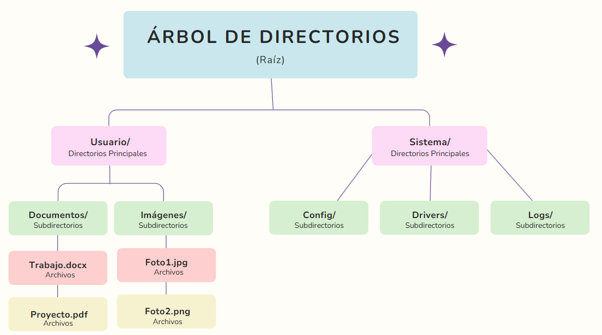
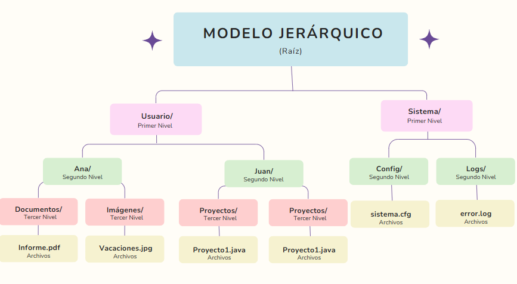

# SISTEMAS OPERATIVOS
    Alumna: FERNANDA ELIZABETH VÉLEZ ALEJANDRE (22121321)

## SISTEMAS DE ARCHIVOS

### EJERCICIO 1: CONCEPTO Y NOCIÓN DE ARCHIVO REAL Y VIRTUAL

#### **CONCEPTOS**
- **ARCHIVO REAL:**  

Se refiere a un archivo físico que existe y está almacenado en un dispositivo de almacenamiento permanente (como un disco duro, SSD, USB, etc.). Contiene datos binarios reales y ocupa un espacio específico en el sistema de archivos.

- **ARCHIVO VIRTUAL:**  

No tiene una representación física directa en el almacenamiento. Se presenta como un archivo, pero su contenido proviene de una fuente dinámica, como la memoria RAM, un proceso o una red. Los sistemas operativos pueden generar archivos virtuales para simplificar el acceso a ciertos recursos.

#### **EJEMPLOS**
- **ARCHIVO REAL:**  
    - Un documento .docx en Windows o Linux almacenado en una carpeta.
    - Una imagen .jpg guardada en un disco duro.

- **ARCHIVO VIRTUAL:**  
    - Linux: Directorio /proc/, donde cada archivo representa información sobre el kernel o procesos en ejecución.
    - Windows: Archivos de sistema como la memoria virtual del archivo pagefile.sys.

#### **CASO PRÁCTICO** Monitoreo de procesos en Linux.
- Los archivos virtuales del directorio /proc/ permiten acceder dinámicamente a la información de procesos en ejecución.
- Razón: No es necesario crear un archivo físico para cada proceso, lo que ahorra espacio y permite actualizar la información en tiempo real.

---
---
### EJERCICIO 2: COMPONENTES DE UN SISTEMA DE ARCHIVOS

#### **COMPONENTES CLAVE DE UN SISTEMA DE ARCHIVOS**
1. *Estructura de directorios:* Organización jerárquica donde se almacenan y gestionan los archivos.
2. *Metadatos:* Información sobre los archivos (nombre, tamaño, permisos, fechas de creación y modificación).
3. *Tablas de asignación:* Mecanismos que mapean el espacio físico del almacenamiento (por ejemplo, FAT, i-nodes).
4. *Espacio de almacenamiento:* Gestión del espacio libre y asignado en discos.
5. *Journaling (registro de cambios):* Proceso que garantiza la consistencia del sistema de archivos después de fallos.
6. *Control de acceso:* Gestión de permisos y seguridad para usuarios y procesos. 

#### **COMPARACIÓN ENTRE EXT4 (LINUX) Y NTFS (WINDOWS)**

| Componente | EXT4 (Linux) | NTFS (Windows) |
|------------|--------------|----------------|
| Metadatos | Usa inodes para almacenar información. | Almacena metadatos en la Master File Table. |
| Tablas de asignación | Extents para asignar bloques de almacenamiento. | Clústeres y registros en la tabla principal. |
| Espacio de almacenamiento | Manejo eficiente con journaling y extents. | Usa bitmaps y journaling para el manejo. |
| Journaling | Soporte de journaling con varios modos. | Soporte de journaling robusto integrado.|
| Control de acceso | Basado en permisos tipo UNIX (lectura, escritura). | ACLs (listas de control de acceso) más detalladas. |
| Tamaño máximo de archivo | 16 TiB | 16 Exabytes |
| Compatibilidad | Mejor en entornos Linux. | Mejor en entornos Windows. |

#### **VENTAJAS Y DESVENTAJAS DE LOS SISTEMAS**

|  | EXT4 (Linux) | NTFS (Windows) |
|------------|--------------|----------------|
| VENTAJAS | Rápido y eficiente para sistemas Linux. | Mejor compatibilidad en entornos Windows. |
|  | Journaling configurable según necesidades. | Soporte de ACLs avanzado. |
|  | Mejor manejo de archivos grandes. | Mayor capacidad de recuperación ante fallos. |
| DESVENTAJAS | Menor compatibilidad con sistemas Windows. | Menor rendimiento en sistemas Linux.|
|  | No tan robusto como NTFS para permisos complejos. | Mayor sobrecarga para discos pequeños. |

---
---
### EJERCICIO 3: ORGANIZACIÓN LÓGICA Y FÍSICA DE ARCHIVOS
Un sistema de archivos es la estructura lógica y física que se utiliza para organizar, almacenar y recuperar datos en un medio de almacenamiento, como discos duros, SSD, USB, entre otros.

**Organización lógica:** Se refiere a la manera en que los archivos y directorios son estructurados y representados de forma comprensible para el usuario. - Ejemplo: la jerarquía de carpetas (árbol de directorios).
**Organización física:** Hace referencia a cómo los archivos y datos son realmente almacenados en bloques de disco (espacios físicos).
La relación entre ambas radica en que la organización lógica facilita el uso del sistema de archivos, mientras que la organización física optimiza la eficiencia en el almacenamiento y recuperación de los datos.

#### **ÁRBOL JERÁRQUICO**
La organización lógica de un sistema de archivos es similar a un árbol, donde:
- El nodo raíz representa el directorio principal (root).
- Los nodos intermedios representan subdirectorios.
- Los nodos hoja representan archivos.



- Raíz (/): Es el nivel más alto del sistema de archivos.
- Directorios principales: "Usuario", "Sistema".
- Subdirectorios: "Documentos", "Música", "Imágenes".
- Archivos: Son las hojas finales, como "Trabajo.docx", "Foto1.jpg".

#### **TRADUCCIÓN DE DIRECCIÓN LÓGICA A FÍSICA**

Los sistemas operativos usan un sistema de asignación para mapear una dirección lógica (nombre del archivo y su estructura jerárquica) a una dirección física (bloques y sectores en el disco).

*Proceso:*
1. El sistema identifica el nombre lógico del archivo y su ubicación en el árbol de directorios.
2. Consulta la tabla de asignación (como FAT o i-nodes).
3. Traduce el nombre lógico a una lista de bloques físicos donde se almacenan los datos.

#### **EJEMPLO PRÁCTICO: ALMACENAMIENTO FÍSICP DE UN ARCHIVO** 
Un archivo grande Archivo_A.txt (por ejemplo, 12 KB) puede dividirse y almacenarse en 4 bloques físicos (3 KB cada uno). La tabla de asignación mantendrá la referencia a cada bloque físico:

| Bloque | Dirección Física |
|------------|--------------|
| 1 | Sector 5 | 
| 2 | Sector 7 | 
| 3 | Sector 8 | 
| 4 | Sector 10| 

Si se necesita acceder a Archivo_A.txt, el sistema primero consulta la tabla y luego recupera los datos en los sectores asignados.

---
---
### EJERCICIO 4: MECANISMOS DE ACCESO A LOS ARCHIVOS

#### **DEFINICIÓN DE MECANISMOS DE ACCESO**
1. Acceso secuencial:
    - Los datos del archivo se leen secuencialmente, uno tras otro.
    - Ejemplo: Archivos de texto o logs.
2. Acceso directo:
    - Se puede acceder a una posición específica en el archivo sin necesidad de leer todo el contenido.
    - Ejemplo: Bases de datos o archivos binarios.
3. Acceso indexado:
    - Utiliza una estructura de índice que guarda las posiciones de los bloques. Se accede primero al índice y luego al bloque deseado.
    - Ejemplo: Sistemas de archivos modernos como NTFS.

#### **PSEUDOCÓDIGOS**

**1. ACCESO SECUENCIAL:** En el acceso secuencial, se lee el archivo de principio a fin, un carácter o bloque de datos a la vez.

*Pseudocódigo:*
```c
INICIO  
    ABRIR archivo en modo lectura  
    SI archivo no existe  
        MOSTRAR "Error: No se puede abrir el archivo"  
        TERMINAR  
    FIN SI  

    MIENTRAS no se haya llegado al final del archivo  
        LEER un carácter del archivo  
        MOSTRAR el carácter  
    FIN MIENTRAS  

    CERRAR archivo  
FIN
```
**2. ACCESO DIRECTO:** En el acceso directo, se accede a una posición específica dentro del archivo utilizando su desplazamiento.

*Pseudocódigo:*
```c
INICIO  
    DEFINIR posicion como ENTERO  
    MOSTRAR "Introduce la posición a acceder:"  
    LEER posicion  

    ABRIR archivo en modo lectura  
    SI archivo no existe  
        MOSTRAR "Error: No se puede abrir el archivo"  
        TERMINAR  
    FIN SI  

    MOVER el puntero del archivo a la posición indicada  
    LEER el carácter en esa posición  
    MOSTRAR "Carácter en la posición", posicion, ":", carácter  

    CERRAR archivo  
FIN
```
**3. ACCESO INDEXADO:** En el acceso indexado, se utiliza un índice (arreglo de posiciones) que indica las ubicaciones específicas en el archivo a las que se desea acceder.

*Pseudocódigo:*
```c
INICIO  
    DEFINIR indices como ARREGLO DE ENTEROS  
    DEFINIR num_indices como ENTERO  
    DEFINIR i como ENTERO  

    MOSTRAR "Número de posiciones en el índice:"  
    LEER num_indices  
    PARA i desde 0 hasta num_indices - 1  
        MOSTRAR "Introduce la posición", i+1, ":"  
        LEER indices[i]  
    FIN PARA  

    ABRIR archivo en modo lectura  
    SI archivo no existe  
        MOSTRAR "Error: No se puede abrir el archivo"  
        TERMINAR  
    FIN SI  

    MOSTRAR "Accediendo a posiciones indexadas:"  
    PARA cada posicion en indices  
        MOVER el puntero del archivo a la posición  
        LEER el carácter en esa posición  
        MOSTRAR "Índice", posicion, "-> Carácter:", carácter  
    FIN PARA  

    CERRAR archivo  
FIN
```
#### **COMPARACIÓN DE VENTAJAS**

| Mecanismo | Ventajas | Desventajas |
|------------|--------------|----------------|
| Secuencial | Simple de implementar y eficiente en archivos pequeños. | Lento para archivos grandes. |
| Directo | Acceso rápido a posiciones específicas. | Más complejo de manejar. |
| Indexado | Combina velocidad y eficiencia al buscar datos. | Requiere espacio adicional para el índice. |
---
---
### EJERCICIO 5: MODELO JERÁRQUICO Y MECANISMOS DE RECUPERACIÓN EN CASO DE FALLA
Un sistema de archivos jerárquico organiza los datos en niveles de directorios y subdirectorios, formando una estructura de árbol.
- Raíz (root): Es el nivel más alto, simbolizado por / en sistemas UNIX/Linux.
- Niveles de directorios: Cada nivel desciende de la raíz y organiza archivos o carpetas en subdirectorios.
- Archivos: Son las hojas finales del árbol donde se almacenan los datos.

#### **MODELO JERÁRQUICO PARA UN SISTEMA DE ARCHIVOS**



1. Raíz (/): Nivel más alto.
2. Primer nivel: Directorios "Usuarios" y "Sistema".
3. Segundo nivel: Subdirectorios individuales como "Ana", "Juan", "Config", "Logs".
4. Tercer nivel: Subdirectorios más específicos como "Documentos", "Imágenes", "Música", "Proyectos", etc.
- Los archivos (ej., Tarea.docx, error.log) son las hojas finales donde se almacena la información.

#### **SIMULACIÓN DE UNA FALLA Y RECUPERACIÓN**
**Escenario de Falla:** Ocurre una falla en el directorio Documentos (perdida de archivos por corrupción o eliminación accidental).

**Pasos de Recuperación**
1. Identificar la Falla: Verificar la ausencia de archivos en el directorio Documentos utilizando herramientas del sistema como:
    - En Windows: dir en la terminal o el explorador de archivos.
2. Restaurar desde Backup: Si existe un respaldo previo, restaurar los archivos desde una copia de seguridad.
    - Herramientas en Windows: Historial de archivos, Restaurar sistema.
3. Simulación de Restauración (Código en C): Supongamos que tenemos un archivo de respaldo comprimido (backup.tar) y necesitamos restaurar los archivos perdidos en el directorio.

*Código en C para "simular" la restauración de un archivo:*
```c
#include <stdio.h>
#include <stdlib.h>

void restaurar_archivo(const char *backup, const char *destino) {
    char comando[200];
    // Simula la restauración utilizando el comando tar en Linux
    sprintf(comando, "tar -xvf %s -C %s", backup, destino);
    printf("Ejecutando: %s\n", comando);
    int resultado = system(comando);
    if (resultado == 0) {
        printf("Restauración exitosa.\n");
    } else {
        printf("Error durante la restauración.\n");
    }
}

int main() {
    const char *archivo_backup = "backup.tar"; // Archivo de respaldo
    const char *directorio_destino = "./Usuario/Documentos";

    printf("Iniciando recuperación del directorio Documentos...\n");
    restaurar_archivo(archivo_backup, directorio_destino);

    return 0;
}
```

#### **HERRAMIENTAS O TÉCNICAS DE RESPALDO**
1. Copia de Seguridad (Backup):Realizar respaldos periódicos de los archivos críticos.
- Windows:
    - Historial de archivos
    - Copia de seguridad del sistema
    - Software externo como Acronis, EaseUS Backup, etc.
2. Redundancia y Recuperación Rápida: 
- Usar sistemas de archivos como RAID para redundancia.
    - RAID 1: Duplica los datos en dos discos para evitar pérdida.
- Configurar puntos de restauración en el sistema operativo.
3. Sistemas de Control de Versiones: Herramientas como Git permiten almacenar versiones previas de archivos importantes.
---
---
---
## PROTECCIÓN Y SEGURIDAD

### EJERCICIO 1: CONCEPTO Y OBJETIVOS DE PROTECCIÓN Y SEGURIDAD
La protección y seguridad son mecanismos fundamentales en los sistemas operativos, cuyo propósito es resguardar los recursos y datos de accesos no autorizados o usos indebidos.

#### **CONCEPTOS**
- **PROTECCIÓN:** Se refiere al control de acceso a los recursos del sistema operativo. Garantiza que cada proceso o usuario tenga acceso únicamente a los recursos autorizados.
    - Ejemplo: Permisos de archivos (lectura, escritura, ejecución) asignados a diferentes usuarios.

- **SEGURIDAD:** Es el conjunto de mecanismos y políticas diseñados para proteger los datos, la información y el sistema contra amenazas o ataques.
    - Ejemplo: Uso de contraseñas seguras para evitar accesos no autorizados.

#### **OBJETIVOS PRINCIPALES**
- Confidencialidad: Garantiza que la información solo sea accesible por usuarios autorizados.
    - Ejemplo: Cifrado de datos en discos duros.
- Integridad: Asegura que los datos y recursos no sean modificados o alterados de manera no autorizada.
    - Ejemplo: Protección contra malware o ataques que corrompen archivos.
- Disponibilidad: Garantiza que los recursos y datos estén accesibles cuando se necesiten.
    - Ejemplo: Sistemas de respaldo y recuperación para evitar pérdida de información en caídas del sistema.

#### **EJEMPLO PRÁCTICO (S.O. WINDOWS)**
- La confidencialidad se aplica mediante la gestión de permisos de archivos en NTFS.
- La integridad se mantiene con herramientas como Windows Defender o firmas digitales para evitar modificaciones no autorizadas.
- La disponibilidad se asegura con copias de seguridad automáticas a través de herramientas como el Historial de Archivos.
---
---
### EJERCICIO 2: CLASIFICACIÓN APLICADA A LA SEGURIDAD
La seguridad en los sistemas operativos se clasifica en distintos tipos según el enfoque o el nivel de protección que proporcionan.

#### **CLASIFICACIONES**
- **SEGURIDAD FÍSICA:** Protege los equipos y dispositivos contra daños físicos o robos.
    - Ejemplo: Control de acceso a servidores mediante cerraduras o tarjetas de identificación.
- **SEGURIDAD LÓGICA:** Abarca la protección de datos y software contra accesos no autorizados.
    - Ejemplo: Contraseñas, cifrado, autenticación multifactor.
- **SEGURIDAD DE RED:** Se enfoca en proteger la transmisión de datos en redes contra accesos no autorizados, intrusiones o ataques.
    - Ejemplo: Uso de firewalls y protocolos seguros como TLS/SSL.

#### **PAPEL DE CADA CLASIFICACIONES**
- **SEGURIDAD FÍSICA:** Es crucial porque un acceso físico al equipo podría comprometer todos los mecanismos lógicos y de red.
- **SEGURIDAD LÓGICA:** Protege la información almacenada y ejecutada en el sistema.
- **SEGURIDAD DE RED:** Seguridad de red: Evita que atacantes externos intercepten o manipulen los datos durante su transferencia.

#### **EJEMPLOS PRÁCTICOS**
- **SEGURIDAD FÍSICA:** Uso de biometría para acceder a un servidor o centro de datos.
- **SEGURIDAD LÓGICA:** Implementación de antivirus y contraseñas robustas en sistemas operativos como Linux.
- **SEGURIDAD DE RED:** Configuración de firewalls y uso de VPN para proteger la red en entornos empresariales.
---
---
### EJERCICIO 3: FUNCIONES DEL SISTEMA DE PROTECCIÓN
Un sistema de protección en un entorno multiusuario se encarga de gestionar y restringir el acceso a los recursos del sistema operativo, asegurando que cada usuario o proceso solo pueda utilizar los recursos permitidos. Esto es crucial para mantener la estabilidad, integridad y seguridad del sistema.

#### **COMO CONTROLA EL ACCESO UN SISTEMA DE PROTECCIÓN**
- El sistema de protección regula el acceso a recursos como memoria, archivos, dispositivos y procesos mediante políticas y mecanismos.
- Utiliza permisos y privilegios para asignar qué usuarios o procesos pueden realizar acciones específicas.
    - Ejemplo: Un usuario puede tener permisos de lectura en un archivo, pero no de escritura.

#### **FUNCIONES PRINCIPALES DEL SISTEMA DE PROTECCIÓN**
- Autenticación: Verifica la identidad del usuario mediante credenciales como contraseñas, biometría o tokens.
    - Ejemplo: Inicio de sesión en un sistema operativo con usuario y contraseña.
- Autorización: Una vez autenticado, determina los recursos a los que el usuario tiene permitido acceder y qué acciones puede realizar.
    - Ejemplo: El usuario "admin" tiene acceso total al sistema, mientras que "user" solo puede leer ciertos archivos.
- Auditoría: Registra las actividades de los usuarios y procesos para detectar comportamientos no autorizados o sospechosos.
    - Ejemplo: Logs del sistema que muestran intentos fallidos de acceso.

#### **CASO PRÁCTICO: FUNCIONES EN ACCIÓN**

**Escenario:** Un sistema multiusuario con los siguientes usuarios y recursos:
- Usuarios: admin, user1, user2
- Recursos: Archivo_A, Archivo_B, Impresora, Base_Datos

| Usuario | Recurso | Permisos |
|------------|--------------|----------------|
| admin | Archivo_A | lectura, escritura, ejecución |
| admin	| Base_Datos | lectura, escritura |
|user1	| Archivo_B	| lectura |
|user2	| Impresora	| impresión |

- Autenticación: Los usuarios deben iniciar sesión con nombre y contraseña.
- Autorización:
    - admin puede leer y modificar todos los archivos.
    - user1 solo puede leer Archivo_B.
    - user2 puede acceder a la impresora.
- Auditoría: El sistema registra intentos de acceso no autorizados.
    - Si user1 intenta escribir en Archivo_A, el intento queda registrado y se niega el acceso.

Este caso muestra cómo las funciones de autenticación, autorización y auditoría garantizan la seguridad y protección en un entorno multiusuario.

---
---
### EJERCICIO 4: IMPLANTACIÓN DE MATRICES DE ACCESO
Una matriz de acceso es una estructura utilizada para controlar y administrar los permisos de acceso en un sistema operativo. Asigna derechos a usuarios específicos para recursos específicos.
- Cada fila representa a un usuario.
- Cada columna representa un recurso.
- Las celdas contienen los permisos asignados al usuario sobre ese recurso (lectura, escritura, ejecución, etc.).
#### **DISEÑO DE UNA MATRIZ DE ACCESO**
Sistema con 3 usuarios y 4 recursos:

|Usuarios/Recursos | Archivo_X | Archivo_Y | Impresora | Base_Datos |
|------------------|-----------|-----------|-----------|------------|
| admin | RWX | RWX | RW |	RWX |
| user1 | R | R | - | - |
| user2 | - | - | W | R |

Permisos:
- R: Lectura
- W: Escritura
- X: Ejecución
- -: Sin acceso

#### **USO DE LA MATRIZ DE ACCESO** 
La matriz de acceso funciona como una tabla que indica qué permisos tiene cada usuario sobre cada recurso.
- El sistema consulta la matriz cada vez que un usuario intenta acceder a un recurso.
- Si el permiso no está en la matriz, el acceso es denegado.

#### **SIMULACIÓN DE UN ESCENARIO** 
**Escenario:**
user1 intenta acceder a Archivo_X con permisos de escritura.

**Proceso:**
1. El sistema verifica la matriz de acceso.
2. En la fila de user1 y la columna Archivo_X, solo se permite lectura (R).
3. Como el permiso de escritura no está asignado, el sistema:
    - Niega el acceso.
    - Registra el intento fallido en los logs del sistema para auditoría.

La matriz de acceso es una herramienta efectiva para controlar los permisos y restringir el acceso en sistemas operativos multiusuario. Permite una administración clara y detallada de los recursos y previene accesos no autorizados.

---
---
### EJERCICIO 5: PROTECCIÓN BASADA EN EL LENGUAJE
La protección basada en el lenguaje utiliza las características y restricciones de los lenguajes de programación para evitar errores o accesos no autorizados, especialmente en el manejo de recursos como memoria y archivos.

#### **CONCEPTO** 
Es un enfoque en el cual los lenguajes de programación incorporan mecanismos de seguridad que ayudan a evitar errores de programación y accesos no autorizados a recursos críticos.
Se centra en evitar vulnerabilidades comunes como desbordamiento de búfer y accesos ilegales a la memoria.

#### **EJEMPLO DE SEGURIDAD EN JAVA** 
- Java implementa un gestor automático de memoria mediante el Garbage Collector, lo que previene errores como el uso de punteros inválidos.
- La ausencia de punteros directos y su modelo de seguridad basado en la máquina virtual (JVM) evita accesos no autorizados a la memoria.
- Ejemplo: El uso de try-catch para controlar excepciones al acceder a archivos o recursos.

#### **COMPARACIÓN CON OTROS MECANISMOS DE PROTECCIÓN**
- Protección basada en hardware: Utiliza características como privilegios en la CPU (modo usuario y modo kernel) para evitar accesos no autorizados.
- Protección en sistemas operativos: Implementa permisos de archivos y procesos para garantizar la seguridad.
- Ventaja del lenguaje: La protección basada en el lenguaje es más flexible y permite aplicar seguridad en el diseño del software, evitando vulnerabilidades antes de la ejecución.

---
---
### EJERCICIO 6: PROTECCIÓN BASADA EN EL LENGUAJE
Las amenazas al sistema operativo comprometen su seguridad, por lo que se implementan mecanismos de validación para protegerlo.

#### **TIPOS DE AMENAZAS COMUNES**
- Malware: Software malicioso como virus, troyanos y gusanos que dañan o controlan el sistema.
    - Ejemplo: Ransomware que cifra archivos y pide un rescate.
- Ataques de fuerza bruta: Intentos repetidos de adivinar credenciales, explotando contraseñas débiles.
    - Ejemplo: Acceso no autorizado a una cuenta de administrador.
- Inyección de código: Inserción de scripts maliciosos en aplicaciones vulnerables.
    - Ejemplo: Inyección SQL para acceder a bases de datos protegidas.

#### **MECANISMOS DE VALIDACIÓN**
- Autenticación multifactor (MFA): Combina múltiples métodos para verificar la identidad de un usuario (contraseña, token, biometría).
- Control de integridad: Herramientas que verifican que los archivos del sistema no hayan sido alterados.
    - Ejemplo: Hashes MD5 o SHA-256 comparados con valores originales para detectar cambios no autorizados.

#### **ESQUEMA DE VALIDACIÓN PARA UN SISTEMA MULTIUSUARIO**
**Escenario:** Sistema operativo con múltiples usuarios y recursos sensibles.
- Autenticación:
Implementación de inicio de sesión con MFA: contraseña + código enviado al móvil del usuario.
- Autorización:
Uso de roles y permisos para restringir el acceso (por ejemplo, usuario estándar, administrador).
- Auditoría:
Registro de logs de accesos y actividades sospechosas.
- Control de integridad:
Escaneo periódico de archivos críticos para validar su integridad.

---
---
### EJERCICIO 7: CIFRADO
El cifrado es una técnica fundamental para proteger la información en sistemas operativos, asegurando que solo usuarios autorizados puedan acceder a los datos.

#### **CONCEPTOS**
**Cifrado simétrico:** Utiliza una única clave para cifrar y descifrar la información.
- Ventaja: Es rápido y eficiente para grandes volúmenes de datos.
- Ejemplo: AES (Advanced Encryption Standard) utilizado en sistemas de archivos cifrados.

**Cifrado asimétrico:** Utiliza un par de claves (pública y privada): la clave pública cifra los datos y la privada los descifra.
- Ventaja: No requiere compartir la clave privada.
- Ejemplo: RSA utilizado en autenticación de sistemas y transmisión segura de datos.

#### **EJEMPLO PRÁCTICO DE CIFRADO**
**Cifrado simétrico:**
En Windows, el sistema de archivos NTFS utiliza BitLocker (AES) para cifrar discos y proteger los datos.

**Cifrado asimétrico:**
En sistemas basados en Linux, el uso de claves SSH permite conexiones seguras entre servidores.

#### **SIMULACIÓN DEL PROCESO DE CIFRADO Y DESCIFRADO**
**Escenario:** Cifrado de un archivo usando AES (simétrico).
- **Clave:** clave_secreta_1234
- **Proceso:**
    1. El archivo original (datos.txt) se cifra con la clave usando una herramienta como openssl en Linux:
    ```C
    openssl enc -aes-256-cbc -salt -in datos.txt -out datos_cifrado.txt -k clave_secreta_1234
    ```

    2. Para descifrar el archivo, se usa la misma clave:
    ```C
    openssl enc -d -aes-256-cbc -in datos_cifrado.txt -out datos_descifrado.txt -k clave_secreta_1234
    ```

- **Resultado:** El archivo original es protegido y solo puede recuperarse con la clave correcta.

---
---
---