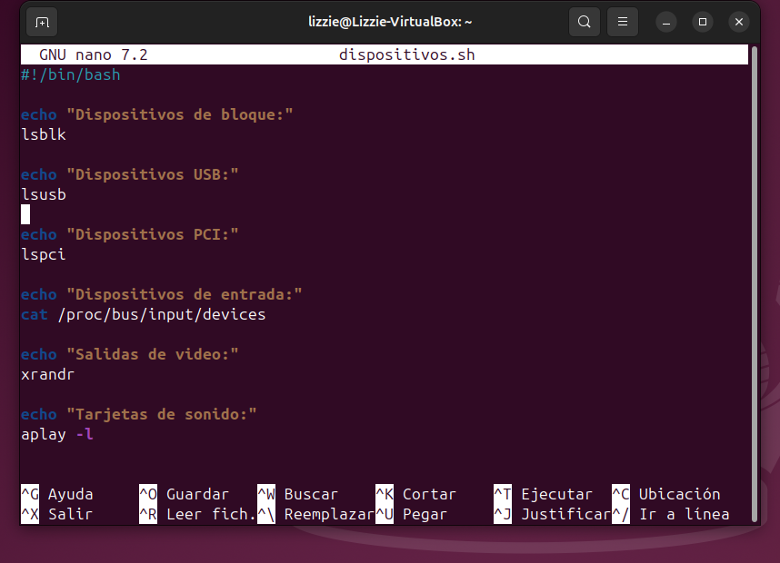
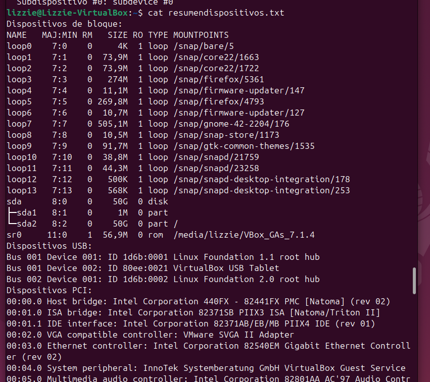

# SISTEMAS OPERATIVOS
    Alumna: FERNANDA ELIZABETH VÉLEZ ALEJANDRE (22121321)

## DISPOSITIVOS DE ENTRADA Y SALIDA EN LINUX 

### ACTIVIDAD 1: LISTAR DISPOSITIVOS CONECTADOS

#### **EJECUCIÓN DE COMANDOS**
- `lsblk`: Este comando enumera todos los dispositivos de bloque conectados al sistema, como discos duros, particiones, memorias USB, etc.


- `lsusb`: Este comando muestra los dispositivos conectados a los puertos USB, indicando el ID del dispositivo, fabricante y detalles básicos.


- `lspci`: Este comando lista los dispositivos conectados al bus PCI. Incluye hardware interno como tarjeta gráfica, tarjeta de red, controladores USB, etc.


- `dmesg | grep usb`: Este comando muestra los mensajes del kernel relacionados con dispositivos USB, útiles para ver logs de conexión/desconexión o errores.


#### **PREGUNTAS**
- ¿Qué tipos de dispositivos se muestran en la salida de `lsblk`?
    - Dispositivos loop: Montajes virtuales usados por aplicaciones snap.
    - Disco virtual (sda): Almacenamiento principal de la máquina virtual.
    - Particiones (sda1, sda2): Divisiones del disco principal.
    - Unidad ROM (sr0): Dispositivo de solo lectura para el CD virtual.

- ¿Cuál es la diferencia entre `lsusb` y `lspci`?

| Comando `lsusb`      | Comando `lspci`                        |
|--------------------|--------------------------------------|
| Muestra solo los dispositivos conectados a los puertos USB. | Lista los dispositivos conectados al bus PCI. |
| Proporciona información básica como el ID del fabricante y ID del producto.  | Incluye hardware interno como tarjetas de red, tarjetas gráficas, controladores USB, controladoras SATA. |
| Ejemplo: memorias USB, cámaras web, teclados, ratones, etc. | Ejemplo: GPU, adaptador Ethernet, tarjetas de sonido. |

- ¿Qué información adicional proporciona `dmesg | grep usb`? 
Proporciona mensajes del kernel relacionados con dispositivos USB e información detallada sobre:

    - La conexión/desconexión de dispositivos USB.
    - Errores o fallos detectados en dispositivos USB.
    - Velocidad del dispositivo (USB 2.0, 3.0, etc.).
    - Reconocimiento del dispositivo por el sistema.
---
---
### ACTIVIDAD 2: VERIFICAR DISPOSITIVOS DE ALMACENAMIENTO

#### **EJECUCIÓN DE COMANDOS**  
- `fdisk -l`: Este comando lista todos los discos duros, particiones y su configuración.


- `blkid`: Este comando muestra los UUID (identificadores únicos de discos) y el tipo de sistema de archivos (por ejemplo, ext4, NTFS, FAT32).


- `df -h`: Este comando muestra los dispositivos montados actualmente y el espacio disponible/ocupado en formato legible para humanos.


#### **PREGUNTAS**
- ¿Qué dispositivos de almacenamiento están conectados a su sistema?
    - /dev/sda: Es el disco principal (virtual en la VM).
    - /dev/sda2: Una partición principal en el disco /dev/sda.
    - /dev/loop0, /dev/loop2, /dev/loop3, /dev/loop4, /dev/loop5, /devloop6: Dispositivos de bucle (loop), que generalmente son utilizados para montar archivos ISO, snaps u otros sistemas de archivos virtuales.
    - /dev/sr0: Un dispositivo de almacenamiento óptico (montado con VBox Guest Additions).
- ¿Qué particiones están montadas actualmente?
    - /dev/sda2 montada en / (raíz del sistema).
    - tmpfs: Se montan temporalmente en varias ubicaciones del sistema, como:
        - /run
        - /dev/shm
        - /run/lock
        - /run/user/1000
    - /dev/sr0 montada en /media/lizzie/VBox_GAs_7.1.4 (imagen ISO de VirtualBox Guest Additions).
- ¿Qué tipo de sistemas de archivos se usan en las particiones?
    - ext4 → Usado en /dev/sda2 (partición principal del sistema).
	- iso9660 → Usado en /dev/sr0 (imagen ISO).
	- squashfs → Usado en dispositivos de bucle (loop) virtuales.

---
---
### ACTIVIDAD 3: EXPLORAR DISPOSITIVOS DE ENTRADA

#### **EJECUCIÓN DE COMANDOS**
- `cat /proc/bus/input/devices`: Este comando mostrará una lista de dispositivos de entrada como teclados, ratones y otros dispositivos conectados.


- `evtest`: Este comando se usa para monitorear eventos de dispositivos de entrada (requiere permisos de superusuario).
    - Teclado:
    - Mouse:
    - Controladores USB adicionales:


#### **PREGUNTAS**
- ¿Qué eventos genera cada dispositivo al interactuar con ellos?
    - TECLADO: 
        - Genera eventos del tipo EV_KEY, donde cada tecla se identifica con un código (por ejemplo, KEY_A al presionar "a").
        - Se registran eventos de presión (KEY_PRESSED) y liberación (KEY_RELEASED).
    - MOUSE:
        - Genera eventos del tipo EV_REL para movimientos relativos en el eje X y Y.
        - También genera eventos EV_KEY para clics en los botones del ratón (por ejemplo, BTN_LEFT para clic izquierdo).

    - CONTROLADORES USB ADICIONALES: Dependiendo del dispositivo (joysticks, cámaras, etc.), pueden generar:
        - EV_ABS para movimientos absolutos.
        - EV_MSC para datos de estado especiales.

- ¿Cómo se identifican los dispositivos en `/proc/bus/input/devices`?
En el archivo /proc/bus/input/devices, los dispositivos de entrada se identifican mediante los siguientes campos:
    - I: Información sobre el dispositivo:
        - Bus: El tipo de bus al que pertenece el dispositivo (ejemplo: Bus=0019).
        - Vendor: ID del proveedor del dispositivo (ejemplo: Vendor=0000).
        - Product: ID del producto (ejemplo: Product=0001).
        - Version: Versión del dispositivo (ejemplo: Version=0000).
    - N: Nombre del dispositivo.
        - Identifica de manera legible el tipo de dispositivo (ejemplo: "Power Button", "Sleep Button", "AT Translated Set 2 keyboard").
    - P: Dirección física del dispositivo.
        - Describe la ruta física o el conector donde está el dispositivo (ejemplo: Phys=isa0060/serio0/input0).
    - S: Ruta en el sistema de archivos de sysfs.
        - Muestra la ubicación en /sys donde se encuentra la información del dispositivo (ejemplo: Sysfs=/devices/platform/...).
    - U: Campo Uniq, que indica un identificador único del dispositivo (si existe).
        - En este caso aparece vacío (Uniq=).
    - H: Handlers (manejadores) asignados al dispositivo.
        - Indican los archivos de eventos o funciones que utiliza el dispositivo.
        - Ejemplo: Handlers=kbd event0 (para teclado), Handlers=sysrq kbd event2 leds (teclado con LEDs).
    - B: Propiedades (Bits) del dispositivo.
        - PROP: Propiedades especiales del dispositivo (en hexadecimal).
        - EV: Eventos admitidos por el dispositivo (ejemplo: EV=3, EV=120013).
        - KEY: Códigos de teclas o botones admitidos.
        - MSC: Eventos misceláneos.
        - LED: Control de LEDs en teclados.
---
---
### ACTIVIDAD 4: EXAMINAR DISPOSITIVOS DE SALIDA

#### **EJECUCIÓN DE COMANDOS**  
- `xrandr`: Este comando lista todas las pantallas (dispositivos de video) conectadas y las resoluciones admitidas.


- `aplay -l`: Este comando muestra las tarjetas de sonido y los dispositivos de audio detectados en el sistema.


- `lsof /dev/snd/*`: `lsof` muestra los procesos que actualmente están utilizando los dispositivos de sonido en `/dev/snd/`.


#### **PREGUNTAS**
- ¿Qué salidas de video están disponibles en su sistema? De acuerdo con el comando xrandr, el sistema cuenta con la salida de video Virtual-1.
Las resoluciones disponibles incluyen:
    - 1920x936 (actual, primaria)
    - 1152x864, 1024x768, 800x600, 640x480, 320x240, 1440x900, 1280x800, entre otras.

- ¿Qué dispositivos de sonido se detectaron?
Según el comando aplay -l, se detectó el siguiente dispositivo de sonido:
    - Tarjeta 0: I82801AAICH [Intel 82801AA-ICH], Dispositivo 0: Intel ICH [Intel 82801AA-ICH].

    Esta tarjeta de sonido tiene 1 subdispositivo (subdevice 0).
- ¿Qué procesos están usando la tarjeta de sonido? Con base en el comando lsof /dev/snd/*, los procesos que utilizan la tarjeta de sonido son:
    - pipewire con PID 1446 (varios archivos abiertos como pcmC0D0p y seq).
    - wireplumb con PID 1450 (controlC0).

---
---
### ACTIVIDAD 5: CREAR UN SCRIPT DE RESUMEN

#### **PASOS PARA CREAR Y EJECUTAR EL SCRIPT**  
1. Crea el script dispositivos.sh
```c
nano dispositivos.sh
```
2. Copia y pega el contenido del script



3. Otorga permisos de ejecución al script y Ejecuta el script


4. Modifica el script para guardar la salida


5. Ejecuta nuevamente el script y Verifica que el archivo de salida se creó



#### **PREGUNTAS**
- ¿Qué ventajas tiene usar un script para recopilar esta información?
    - Automatización: Se recopila toda la información con un solo comando.
    - Ahorro de tiempo: No necesitas ejecutar cada comando manualmente.
    - Reproducibilidad: Puedes ejecutar el script en diferentes sistemas y obtener resultados consistentes.
    - Registro: La información se puede guardar fácilmente en un archivo para futuras referencias o análisis.

- ¿Qué cambios realizaría para personalizar el script?
    - Formato de salida: Agregar líneas separadoras o encabezados para mejorar la legibilidad del archivo de salida.
    - Selección de información: Incluir parámetros para elegir qué tipos de dispositivos listar. Por ejemplo:

    ```c
    if [ "$1" == "usb" ]; then
      lsusb
    elif [ "$1" == "pci" ]; then
      lspci
    fi
    ```
    - Agregar fecha y hora: Incluir un timestamp en el archivo de salida para identificar cuándo se recopiló la información
    ```c
    echo "Fecha y hora: $(date)" >> resumendispositivos.txt
    ```
    - Compresión de resultados: Comprimir el archivo de salida automáticamente para ahorrar espacio.
---
---
### ACTIVIDAD 6: REFLEXIÓN Y DISCUSIÓN

#### **PREGUNTAS**
- **¿Qué comando encontró más útil y por qué?**
De todos los comandos utilizados en las actividades, el que considero más util es `dmesg | grep usb`, ya que permite verificar los mensajes del kernel en tiempo real y filtrar solo la información relacionada con dispositivos USB. Esto resulta útil para diagnosticar problemas al conectar dispositivos externos, como discos duros, memorias USB o periféricos. Además, ayuda a identificar cuándo un dispositivo no es reconocido o tiene algún error de conexión.

- **¿Qué tan importante es conocer los dispositivos conectados al sistema?**
Conocer los dispositivos conectados al sistema es fundamental en la administración y el mantenimiento de un sistema Linux. La identificación adecuada de dispositivos de entrada, salida y almacenamiento permite:
    - Diagnosticar y solucionar problemas de hardware.
    - Optimización de recursos.
    - Seguridad y control.
    - Configuración eficiente.

    En entornos empresariales o servidores, el conocimiento de dispositivos conectados asegura una gestión proactiva de los recursos de hardware y contribuye a evitar caídas o fallas críticas en los sistemas.
- **¿Cómo podrían estos conocimientos aplicarse en la administración de sistemas?**
En la administración de sistemas, estos conocimientos son esenciales porque permiten una gestión eficiente y efectiva del hardware del sistema. Algunas aplicaciones clave son:
    - Monitoreo de hardware y mantenimiento preventivo.
    - Solución de problemas.
    - Administración de almacenamiento.
    - Optimización del rendimiento del sistema.
    - Configuración de sistemas personalizados.
    - Seguridad.

Estos conocimientos no solo son útiles para diagnosticar y solucionar problemas, sino que también permiten anticipar posibles fallos, optimizar el uso del hardware y garantizar que el sistema funcione de manera eficiente y segura.

---
---
---